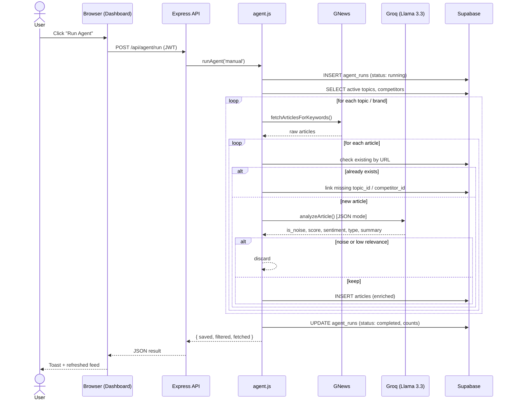

# 👗 Fashion Intel — Fashion Brand News Monitoring Agent

An AI-powered Node.js agent that monitors fashion brand news in real time, filters noise intelligently, and delivers structured brand intelligence through a clean editorial UI.

---

## ✨ Features

- **AI-powered analysis** — Groq + Llama 3.3 70B scores relevance, detects sentiment, classifies news type, and extracts key insights
- **Noise filtering** — irrelevant articles are automatically discarded (score < 4 / off-topic)
- **Zod validation** — every API request and AI response is validated before touching the database
- **Dual logging** — Winston writes structured logs to file + Supabase `logs` table, viewable in the UI
- **Scheduled runs** — node-cron triggers automatic monitoring every 6 hours (configurable)
- **Full CRUD** — add/remove/toggle topics, brands, and sources via the Settings page
- **Auth** — JWT-based signup/login with bcrypt password hashing
- **Fashion-editorial UI** — dark aesthetic, animated thread background, Playfair Display typography

---

## 🛠 Tech Stack

| Layer | Technology | Why this, and not the alternative |
|---|---|---|
| **Backend runtime** | Node.js + Express | The role explicitly hires for Node.js. Express keeps every request/response explicit — no hidden magic — which matters when you're asked to explain every line in a technical interview. |
| **Frontend** | Vanilla JS + HTML + CSS (no framework) | As The role was Node.js Developer. A build-free frontend means zero webpack/vite config to explain, and every DOM update is a plain template string. A small shared `shell.js` avoids the copy-paste-header problem without needing a component framework. |
| **Database** | Supabase (PostgreSQL) | Real relational structure (foreign keys between articles/topics/competitors) beats a document store here, since the linking-bug fix in §5.1 depends on relational integrity. Supabase specifically because it's free-tier friendly and gives hosted Postgres + a client SDK with zero ops. |
| **AI** | Groq + Llama 3.3 70B | Sub-second inference per article and a generous free tier. `response_format: json_object` gives structured-output guarantees comparable to OpenAI's function calling. |
| **News source** | GNews API | Simple REST API, workable free tier (100 req/day) for an MVP, no complex auth. |
| **Validation** | Zod | Validates both inbound API requests *and* AI-generated JSON before it touches the database. Most take-home submissions skip validation entirely — deliberate signal of production-mindedness. |
| **Logging** | Winston + DB-backed activity log (on local Server only)| Structured logs (file) for post-mortem debugging, plus a DB transport so log activity is visible in the UI without server access. |
| **Scheduling** | `node-cron` | The one-line difference between "a script you run" and "an agent that monitors continuously." |
| **Auth** | JWT (`jsonwebtoken`) + `bcryptjs` | Stateless auth needs no session store; bcrypt with 12 salt rounds is the standard for password hashing. |
| **Logos** | `unavatar.io` + Google Favicon Service (cascading fallback) |

---

## 📖 How It Works

1. **Sign up / log in** at `/login`
2. On the **Dashboard**, click **Run Agent** to trigger a monitoring cycle
3. The agent fetches news for every active topic and brand from GNews
4. Each article is analyzed by Groq AI:
   - Relevance scored 1–10 (articles below 4 are filtered)
   - Sentiment classified (positive / negative / neutral)
   - News type detected (product launch, campaign, discount, earnings, etc.)
   - 2 key insights extracted for brand analysts
5. Results appear in the **Intelligence Feed** with filters by type and sentiment
6. **Settings** → add or remove topics, brands, and sources at any time
7. **Agent Runs** → view full history of every monitoring cycle
8. **Activity Log** → real-time server logs stored in the database

##  Functionalities

###  Authentication (Signup / Login)

1. **Sign up** (`POST /api/auth/signup`) — user submits name, email, password. Zod validates the shape (name ≥ 2 chars, valid email, password ≥ 8 chars). The server checks for an existing account with that email, hashes the password with `bcryptjs` (12 salt rounds), inserts the user row, and returns a signed JWT (7-day expiry) plus the user object.
2. **Log in** (`POST /api/auth/login`) — looks up the user by email, compares the submitted password against the stored hash with `bcrypt.compare`, and returns the same JWT shape on success.
3. The frontend (`public/js/auth.js`) stores `{ token, user }` in `localStorage` and attaches `Authorization: Bearer <token>` to every subsequent API call via `public/js/api.js`.
4. `requireAuth()` runs at the top of every protected page and redirects to `/login` if no token is present; `redirectIfAuth()` does the opposite on the login page itself, so a logged-in user never sees the login form again.
5. Every protected API route runs `authMiddleware` (`src/middleware/auth.js`), which verifies the JWT signature and expiry before the route handler executes.

###  The Agent (core workflow)

Triggered either manually (**"Run Agent"** button on the Dashboard or Agent Runs page) or automatically every 6 hours by the cron scheduler:

1. Load all **active** topics and brands from the database
2. For each one, query GNews with its keyword list
3. Skip anything already in the database (by URL) — or **link** a missing topic/brand association if it's a duplicate discovered from a different angle
4. Send new articles to Groq for AI analysis: is this noise? How relevant (1–10)? What sentiment? What type of news? A one-sentence summary and two key takeaways
5. Discard noise and low-relevance results (score < 4); save everything else
6. Log a full run summary (fetched / saved / filtered / linked counts) to `agent_runs`, viewable on the **Agent Runs** page

###  Dashboard

- **Breaking ticker** — scrolling headline strip of the latest articles
- **Hero card** — the single most relevant recent article, full-width with image
- **Filter bar** (collapsible) — filter by news type (product launch, campaign, discount, earnings, acquisition, trend, controversy, partnership, regulation, sustainability, other) and sentiment (positive/negative/neutral)
- **Article grid** — image-first cards with type/sentiment/brand/topic tags, AI summary, source, date, and a relevance indicator
- **Brand Pulse** — sidebar widget showing the top brands by article volume, each with a stacked sentiment bar (green/red/grey) and logo, sourced from the server-side `/api/competitors/stats` aggregate (not a client-side slice )
- **Consumer Signals chart** — horizontal bar chart of article volume by brand category
- **Trending Topics** — clickable chips (brand names, topic names, and extracted proper nouns from recent headlines) linking to the relevant brand profile
- **Recent list** — compact secondary feed

###  Manage Searches 

Three independent CRUD panels — Topics, Brands/Competitors, Sources — each showing existing entries with an Active/Paused toggle and a delete button, and a form to add new ones. Only a **name** is strictly required; keywords default to the name itself, and for recognized brands the category auto-fills from the curated brand database.

###  Brand Directory & Brand Profile

- **Directory** — grid of every tracked brand with logo, category, and live article count (from the accurate server-side stats endpoint)
- **Profile page** — logo, category, an "About" section (founding year, HQ, product category, one-paragraph bio, and clickable Website/Instagram/Facebook icons) pulled from the curated brand database, sentiment stat cards, and the full article feed for that specific brand (fetched server-side by `competitor_id`, not filtered from a capped list)
- Reached either by clicking a brand anywhere in the app, or by typing a brand name into global search and pressing Enter

### Category Browsing 

Mirrors FashionUnited's navigation taxonomy (Executive, Fashion, Retail, Business, Culture, People, Fairs, Statistics, Education) by mapping each category to a set of `news_type` values and filtering the article table accordingly.

### Agent Runs & Activity Log (localhost only)

- **Agent Runs** — full history of every run (manual or scheduled) with status, duration, and fetched/saved/filtered counts, plus a "Run Now" button
- **Activity Log** — live-updating table of every `logger.*()` call across the whole backend, filterable by level, auto-refreshing every 30 seconds

Both are automatically hidden from the navigation when the app isn't running on `localhost`, since they're internal debugging tools rather than end-user features.

---

<!-- ============================================================
     4. SYSTEM ARCHITECTURE
============================================================ -->

##  System Architecture

The system has four layers, and the key rule is that the **browser only ever talks to the Express server** — never directly to Supabase or to the external APIs. This single-entry-point design is what lets JWT auth live in one place (`authMiddleware`) and is also why Row Level Security is safely left off — the database is never reachable except through code that already checked the token.

- **Client** — every page (dashboard, brand profile, settings, etc.) is a static HTML file that calls the API via `api.js`
- **Server** — Express routes validate the request, then either read/write Supabase directly (for CRUD) or hand off to the **Agent orchestrator** (for anything news-related)
- **External Services** — GNews (news source), Groq (AI analysis), and the logo fallback chain are the only third parties the server talks to; none of them are ever exposed to the browser
- **Data** — Supabase/Postgres, with `articles` as the central table linking back to both `topics` and `competitors`

**Request flow for a manual "Run Agent" click:**

This traces one click end-to-end: the browser sends an authenticated `POST`, the API hands off to `runAgent()`, which logs a `running` row **before** doing any work (so even a crash mid-run leaves an auditable record), then loops through every active topic and brand. For each article found, it either **links** a missing association onto an existing row (if the URL was already seen) or runs it through Groq and saves it if it clears the noise/relevance bar. The final `UPDATE` to `agent_runs` and the JSON response back to the browser happen only after every topic and brand has been processed — which is also why a run can take a couple of minutes end-to-end when many brands are active.

---

## Future Enhancements

### Roadmap

| Phase | Timeframe | Key improvements |
|---|---|---|
| **Short-term** | Week 1–2 | Deduplication hardening across all query angles · Email/Slack digest notifications (Nodemailer / Slack webhooks) · RSS feed ingestion (Business of Fashion, WWD, Vogue Business) to reduce GNews dependency · Role-based access (admin vs analyst) enforced on API routes · httpOnly cookie sessions instead of `localStorage` JWT |
| **Medium-term** | Month 1 | Trend-spike detection (alert when a brand appears in 5+ articles within 24h) · Brand-vs-brand comparison view · Multi-language / multi-market GNews queries · Cursor-based pagination for the article feed · Article bookmarking/archiving with PDF export |
| **Long-term** | 3–6 months | Fine-tuned relevance classifier to pre-filter articles before spending Groq tokens on obviously irrelevant ones · Social signal integration (X/Twitter, Instagram mention volume) · Multi-tenant architecture (separate topic/brand lists per team) · Observability stack (Prometheus + Grafana) for run time, latency, and error-rate monitoring |

### Production APIs to add

| Service | Purpose | Replaces / augments |
|---|---|---|
| NewsAPI.org (paid tier) | Broader source coverage, higher daily quota | GNews free tier (100 req/day ceiling) |
| Bing News Search API | Real-time indexing for breaking news | Supplements GNews |
| SerpAPI | Google News scraping for sources GNews doesn't index | Supplements GNews |
| Twitter/X API v2 | Social brand-mention volume and sentiment | New signal source |
| SendGrid | Reliable transactional email for digests | New capability |
| Groq paid tier / OpenAI fallback | Removes the 100k tokens/day ceiling | Current Groq free tier |

### Known limitations of the current prototype

- GNews free tier caps monitoring scale at roughly 15–20 active topics/brands per 6-hour run
- Groq's free tier token budget can be exhausted by a single large run if too many brands are active simultaneously (see §5.9)
- No real-time push — the scheduler polls every 6 hours rather than reacting to breaking news instantly
- Session tokens live in `localStorage`, which is simpler but less secure than httpOnly cookies against XSS
- No automated test suite yet — verification during development was manual + log inspection

### Future System Architecture

This is the same system, redrawn for a scale where the current bottleneck would actually bite in production: many more brands, more frequent runs, and multiple teams. Three structural changes distinguish it from diagram — a load-balanced, horizontally-scaled API layer instead of one process; ingestion moved out of the request path entirely into a **worker pool**; and a broader set of ingestion sources feeding into notification channels rather than only a dashboard.

The key structural change from the current architecture: **a fine-tuned classifier sits in front of the expensive full AI analysis call**, so Groq/OpenAI tokens are only spent on articles that already look promising — directly addressing the token-budget limitation in §5.9 at scale. Agent runs also move from a single in-process scheduler to a **decoupled worker pool**, so a slow or failing run never blocks the API from serving dashboard requests.
